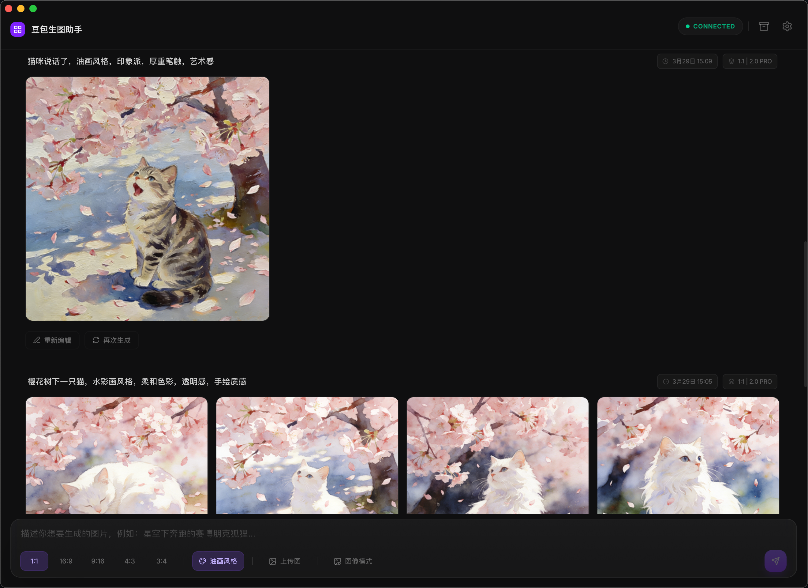

# 豆包生图助手 (Doubao Image Assistant)



一款专为 Mac/Windows 打造的豆包 (Doubao) AI 绘图辅助管理工具。它能将你的浏览器绘图体验原生化，提供极致丝滑的画廊管理、本地持久化存储以及高级图片处理功能。

## ✨ 核心特性

- 🎨 **原生 UI 体验**：采用极简"积木 (Jimeng)"风格，完美适配 Mac 系统的标题栏 (TitleBar Overlay)。
- 🔗 **实时同步**：通过本地 WebSocket 实现浏览器与桌面端无缝同步，生成即显示。
- 📦 **本地持久化**：内置 SQLite 数据库，所有提示词与生成结果永久保存，支持离线翻阅。
- 💎 **高清无水印**：支持直接下载/保存 **高清、无水印** 的原图，完美保存每一处细节。
- 🖼️ **全能画廊**：支持一键复用提示词、设为参考图、批量预览及本地管理。
- 🛠️ **图片处理**：集成原生图片压缩工具，支持预览压缩前后效果。
- 🚀 **独立运行**：内置 Rust 服务端，无需安装 Node.js，打开即用。

## 📥 下载安装

### 桌面端应用

前往 [Releases](https://github.com/abc-kkk/doubao-image-studio/releases) 页面下载：

| 平台 | 文件 | 说明 |
|------|------|------|
| macOS | `doubao-assistant_*.dmg` | 双击打开，将应用拖入 Applications |
| Windows | `doubao-assistant_*.exe` | 双击运行安装 |

### Chrome 浏览器扩展

1. 前往 [Releases](https://github.com/abc-kkk/doubao-image-studio/releases) 页面
2. 下载 `doubao-assistant-chrome-extension.zip`
3. 解压后得到 `dist` 文件夹
4. 打开 Chrome，进入 `chrome://extensions/`
5. 开启右上角的"开发者模式"
6. 点击"加载已解压的扩展程序"
7. 选择解压后的 `dist` 文件夹

## 🚀 快速开始

### 1. 安装应用
下载并安装对应平台的桌面端应用（见上文）。

### 2. 安装浏览器扩展
按照上文步骤安装 Chrome 扩展（**必须安装，扩展负责劫持豆包页面并转发生成结果**）。

### 3. 开始使用
- 启动 **豆包生图助手**
- 在浏览器打开 [豆包官网](https://www.doubao.com/) 开始生图
- 你的生成结果将自动出现在桌面端的画廊中

**注意**：扩展需要连接到桌面端应用。如果连接状态显示"Connecting"，请确保：
1. 桌面端应用已启动
2. 浏览器扩展已安装并启用

## 🛠️ 开发指南

项目采用以下技术栈：
- **Frontend**: React + TypeScript + Vite + Tailwind CSS
- **Backend**: Rust (Tauri) + Rust Axum (内置，无需 Node.js)
- **Database**: SQLite (rusqlite)

### 本地开发
```bash
# 安装依赖
npm install

# 启动开发模式
npm run tauri dev
```

### 构建发布包
```bash
npm run tauri build
```

## ⚖️ 免责声明 (Disclaimer)

1. **用途说明**：本项目仅供 **个人学习**、**技术探讨** 及 **学术交流** 使用。
2. **版权归属**：本项目使用的"豆包"相关接口及品牌归原厂家所有，开发者无意侵犯任何公司或个人的合法权益。
3. **责任限制**：用户需对使用本软件的行为独立承担责任。本软件开发者不保证软件的绝对稳定性，对于因使用本软件造成的任何数据丢失、系统损坏、法律纠纷或其他直接/间接经济损失，**开发者不承担任何形式的法律责任**。
4. **安全提示**：请勿将本软件用于任何违反法律法规及目标网站服务条款的行为。
